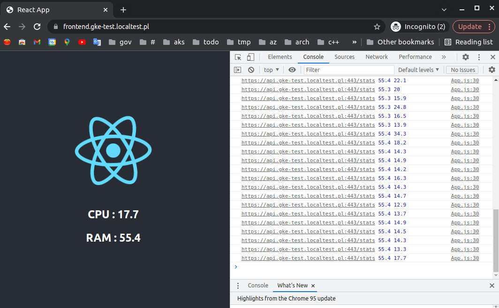
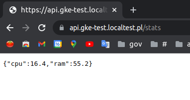

# Todo

## Task 1
- [x] - Contenerize app
- [x] - Automate requirements.txt generation:
  - [x] - script on host
  - [x] - docker container
- [x] - Develop locally with docker-compose 
- [x] - Enable https with letsencrypt certs in docker-compose
  - [x] - Google cloud dns for cert challenge
  - [x] - amce.sh to generate certs
- [x] - GitHub actions for CI (build, test) and push images to Docker Hub
## Task 2
- [ ] - Deploy to AWS 
## Task 3
- [x] - Deploy kubernetes with kind cluster
- [x] - Deploy kubernetes with minikube (for ingress to work require to write `<IP address> <host>` to /etc/hosts)
- [x] - Enable https with letsencrypt certs in kuberntes: kubed, cert-manager, nginx-ingress
- [ ] - Use kustomization, helm + fluxcd in k8s cluster to sync with github
- [ ] - Add auto update of version of images on push to dockerhub
# Result






# How to

## Note

Secrets required are: 

## Docker Hub
- .secrets/DOCKER_HUB_ID
- .secrets/DOCKER_HUB_PASSWORD
## Google cloud serivce account to manage cloud dns
- src/acme/secrets/gcloud.json
- helm/cert-manager-resources/secrets/gke-service-accounts/gke-test-dns-key.localtest-pl.json

## Local development with docker-compose

```sh
## Generate api requirements
make docker-gen-api-requirements

## Docker-compose build + up
make dc-upb

## Tests
make tests
```

Go to browser:
- https://api.gke-test.localtest.pl/stats
- https://frontend.gke-test.localtest.pl/

## AWS development with docker-compose

N/A

## Local development with K8s kind cluster

```sh
## Create k8s cluster with infra and app resources
make create-cluster-kindnes 

## OR minikube
make create-cluster-minikube
## then also need to manually help resolve ingress hosts
## grab list of <address> <host>, ie...
## ... 192.168.49.2 api.gke-test.localtest.pl
## ... 192.168.49.2 frontend.gke-test.localtest.pl
kubectl get ing -A | awk '{ print $5" "$4; }' | grep -v 'ADDRESS HOSTS'
## add them to host DNS mapping in form: <address> <host1> <host2>, like...
## ... 192.168.49.2 api.gke-test.localtest.pl frontend.gke-test.localtest.pl
sudo vim /etc/hosts

## Develop app in src/...
## ...
## Change images versions...

## Push changes to github
git add -A
git commit -m "Push changes."
git push

## Redeploy app
make helm-deploy-smartcow

## Tests
make tests
```

Go to browser:
- https://api.gke-test.localtest.pl/stats
- https://frontend.gke-test.localtest.pl/