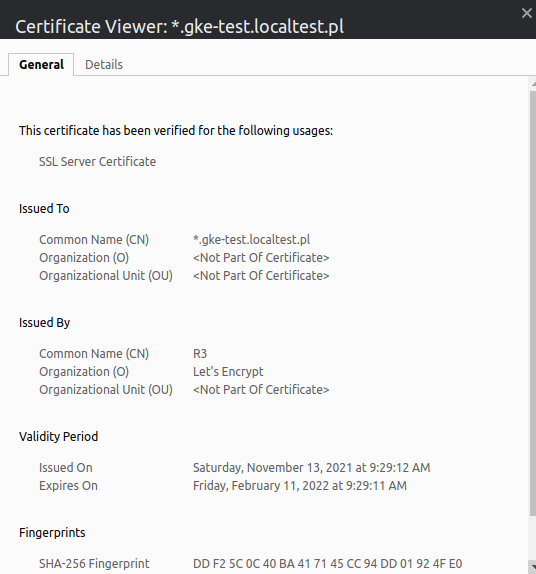

# Result





# How to

## Note

Secrets to regenerate ssl certs and that are required: 

## Docker Hub
- .secrets/DOCKER_HUB_ID
- .secrets/DOCKER_HUB_PASSWORD
## Google cloud serivce account to manage cloud dns
- src/acme/secrets/gcloud.json
- helm/cert-manager-resources/secrets/gke-service-accounts/gke-test-dns-key.localtest-pl.json


## Local development with docker-compose

```sh
## Generate api requirements
make docker-gen-api-requirements

## Docker-compose build + up
make dc-upb

## Tests
make tests
```

Go to browser:
- https://api.gke-test.localtest.pl/stats
- https://frontend.gke-test.localtest.pl/
- https://proxy.gke-test.localtest.pl/

## AWS development with docker-compose

N/A

## Local development with K8s cluster (existing)


```sh
## Redeploy app
make helm-deploy-demoapp

## Tests
make helm-tests
```

# Issues

## Gracefuly stopping containers

[Gracefully Stopping Docker Containers - CenturyLink Cloud Developer Center](https://www.ctl.io/developers/blog/post/gracefully-stopping-docker-containers/#:~:text=docker%20rm%20%2Df,to%20first%20issue%20a%20SIGKILL.)